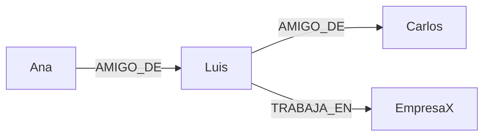

# Cambio de enfoque, de datos a conexiones

Ahora vamos a dar un paso atrás y replantear el problema.

En lugar de pensar en tablas, vamos a pensar en entidades conectadas.

Un grafo está compuesto por:

* nodos, que representan entidades
* relaciones, que representan conexiones
* propiedades, que describen a ambos

La clave aquí es que la relación deja de ser algo implícito (como en un join) y pasa a ser una entidad de primer nivel.

```text
(Ana) -[AMIGO_DE]-> (Luis)
(Luis) -[AMIGO_DE]-> (Carlos)
(Luis) -[TRABAJA_EN]-> (EmpresaX)
```

Este modelo refleja directamente la realidad del problema, sin necesidad de reconstruir relaciones en tiempo de consulta.

### Representación de grafos

El mismo ejemplo se puede visualizar como un grafo. No necesitas renderizarlo, lo importante es entender cómo fluye la información.



Observa que las relaciones tienen dirección y significado. No es simplemente una conexión, es una relación con contexto.


